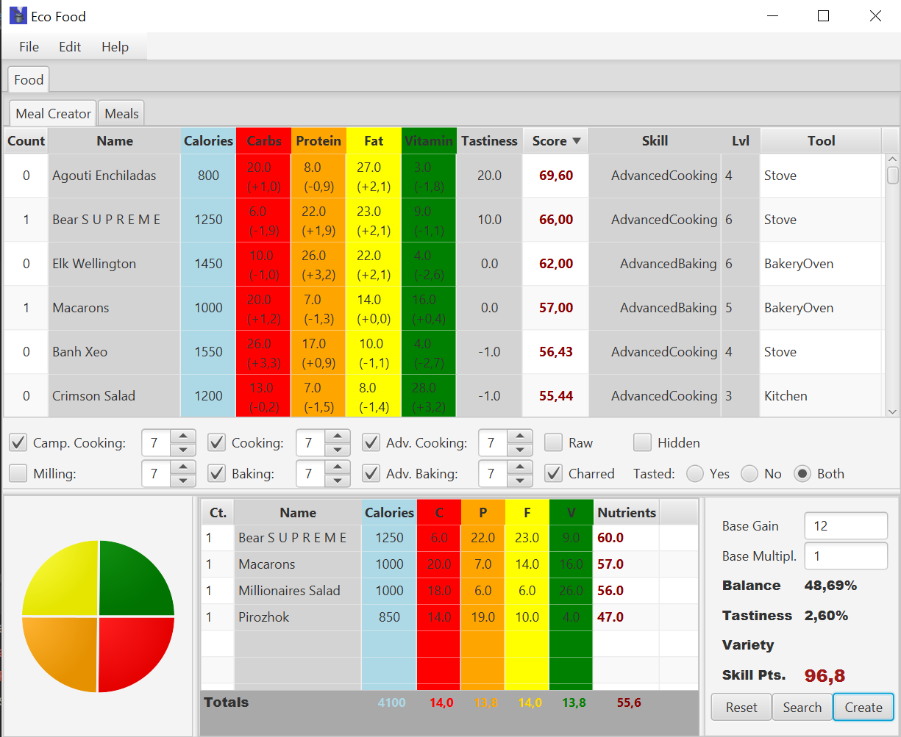

# EcoFood

A calculator to help you find your optimal diet for the game Eco. This program has been developed over the course of several years, with long breaks in between, with repeated major changes and without any prior planning, while at the same time learning JavaFX for the first time. So if you want to look at or work with the code, be warned: it's an uncommented mess! :p

Installation:

Just download the .jar and double click it. You need the Java Runtime Environment 8 (JRE8) installed- If double clicking doesn't work, open the terminal and launch the java.exe in the bin folder of the JRE installation path with following parameters: java.exe -jar C:\Downloads\EcoFood.jar (changing the path as appropirate).

Recommended Workflow:

- Import the available food items directly from Eco: File->Import from Eco. No support for modded food items, but if they are implemented in .cs files similar to the core game files they should be able to be imported, if you cope them over to the Food, Recipe and Seed folders in ..\Eco\Eco_Data\Server\Mods\\\_\_core\_\_\AutoGen
- Set the tastiness of food items you tried: click three times on the Tastiness coloumn of a food item to set its tastiness, "-1" mean not tasted yet.
- When you have tried enough new food items, ad the 20-30 best food items (highest score) to the meal: Edit->Add Best
- Click on the search button and in the new window click the generate button. Note to yourself what is the highest score, then increase the number of items per meal by 1 and generate again. Repeat until you are satisfied with the generate meal or generation time gets too long.
- If you found a promising meal, you can click the Refine Button, to further improve it (it will add the selected meal as a new Food item and then do the same as the Generate Button)
- Save any meals you want to keep
- Back in the main window change to the "Meals" Tab to further plan your diet i.e. by adding diverse food items to increase your variety modifier.

Remember to save your plan regularly (File->Save), so you dont loose all your entered Tatstiness values and created meals!
